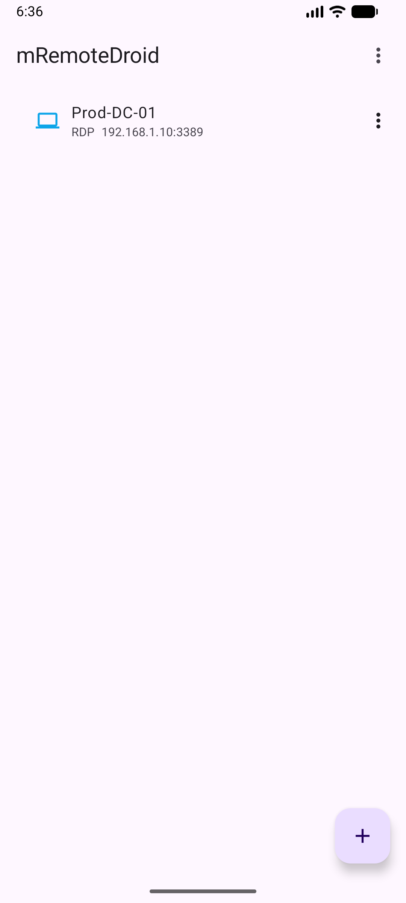
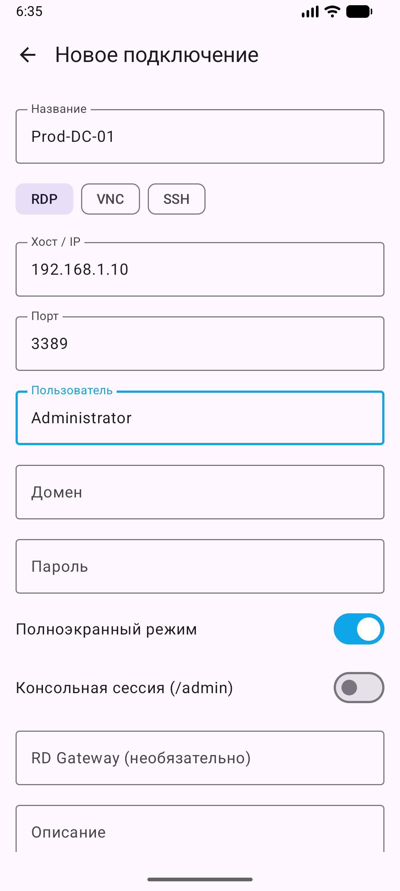
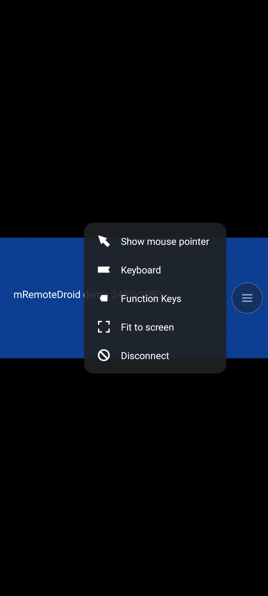

# mRemoteDroid

Менеджер RDP-подключений для Android в духе [mRemoteNG](https://github.com/mRemoteNG/mRemoteNG) со **встроенным RDP-движком FreeRDP** — сеанс открывается прямо в приложении, без сторонних клиентов.

## Возможности (1.0.3)

- 🖥️ **Встроенный RDP** (FreeRDP 3.11 + OpenSSL): полноэкранный сеанс, альбомное разрешение по размеру экрана, «вписать в экран» в портрете, pinch-zoom.
- ✋ **Управление касаниями**: тап — клик, двойной тап — двойной клик, долгий тап — перетаскивание, два пальца — прокрутка / правый клик; режим курсора мыши.
- ⌨️ **Клавиатура**: Unicode-ввод (кириллица и латиница независимо от раскладки на сервере), Backspace/Enter, панель Esc/Shift/Ctrl/Win/Alt и функциональные клавиши; долгое нажатие на плавающую кнопку — показать/скрыть клавиатуру.
- 🔘 **Плавающее меню сеанса** (перетаскиваемое): курсор мыши, клавиатура, F-клавиши, поворот, вписать в экран, отключиться.
- 🔄 **Свой автоповорот сеанса**: «Поворот: авто / альбомный / портретный»; режим «авто» работает по датчику даже при выключенном системном автоповороте, выбор запоминается.
- 🏛️ **Старые серверы**: Windows Server 2008 / 2008 R2 (TLS 1.0, сертификаты SHA1, RDP Security с RC4); новые серверы по-прежнему используют TLS 1.2/1.3 и NLA.
- 🔋 **Сеанс не рвётся при выключенном экране**: foreground-сервис с уведомлением «Подключено: хост».
- 🗂️ **Дерево папок и подключений**, поиск и сортировка.
- 🔐 **Пароли** шифруются AES-256/GCM ключом из Android Keystore; опционально — биометрическая разблокировка.
- 📥📤 **Импорт и экспорт `confCons.xml`** mRemoteNG (≥1.76, AES-GCM/PBKDF2; дефолтный пароль файла `mR3m`) с расшифровкой/шифрованием паролей.

## Скриншоты

| Дерево | Подключение | Сеанс (демо) | Меню сеанса |
|---|---|---|---|
|  |  |  |  |

## Стек

- Kotlin + Jetpack Compose (Material 3), Room, Navigation Compose, androidx.biometric
- Модуль `:freeRDPCore` — Android-клиент FreeRDP (JNI + экран сеанса), доработан: immersive fullscreen, клавиатура/IME, касания, keep-alive
- `minSdk 26`, `targetSdk 36`, ABI: `arm64-v8a`, `x86_64`

## Структура

```
app/                         приложение (дерево подключений, импорт/экспорт, настройки)
  launch/EmbeddedRdpLauncher.kt   запуск сеанса (freerdp:// → SessionActivity)
freeRDPCore/                 FreeRDP Android client
  src/main/cpp/              JNI-мост (собирается локально через NDK)
  src/main/jniLibs/<abi>/    предсобранные libfreerdp3/winpr3/freerdp-client3/ssl/crypto/cjson + include/
.github/workflows/build-freerdp.yml   сборка нативных библиотек FreeRDP на Linux (Release)
```

## Сборка

Нужны Android Studio (JBR 17+), Android SDK 36, NDK `27.2.12479018`, CMake `3.22.1`.

```bash
./gradlew assembleRelease
```

Готовые APK — по одному на ABI (`app-arm64-v8a-release.apk` для телефонов) и универсальный.

**Подпись release**: локальный `keystore.properties` (в git не попадает):

```properties
storeFile=keystore/release.jks
storePassword=...
keyAlias=mremotedroid
keyPassword=...
```

Без него release собирается неподписанным. Подпись v2 + v3.

**Нативные библиотеки FreeRDP** собираются не на Windows, а в GitHub Actions: запустить workflow *Build FreeRDP Android libs*, скачать артефакт `freerdp-jnilibs` и положить `.so` + `include/` в `freeRDPCore/src/main/jniLibs/<abi>/` (`.so` стоит стрипнуть `llvm-strip --strip-debug`).

## Отладка

Debug-сборка умеет открыть демо-сеанс без сервера (весь UI сеанса, ввод пишется в logcat как `LibFreeRDP: demo ...`):

```bash
adb shell am start -a android.intent.action.VIEW -d freerdp://demo.local -n com.mremotedroid.app/com.freerdp.freerdpcore.presentation.SessionActivity
```

Если подключение не устанавливается, лог FreeRDP можно снять так:

```bash
adb logcat -s FreeRDP:* GlobalApp:* com.freerdp.*:*
```

## История версий

- **1.0.3** — подключение к Windows Server 2008 / 2008 R2 (TLS 1.0 и SHA1 разрешены: OpenSSL 3 по умолчанию их отклонял).
- **1.0.2** — автоповорот сеанса внутри приложения, пункт меню «Поворот».
- **1.0.1** — ручное отключение больше не показывает «Соединение прервано».
- **1.0.0** — только встроенный RDP (вызов сторонних клиентов убран), R8, подпись v2+v3, APK по ABI.
